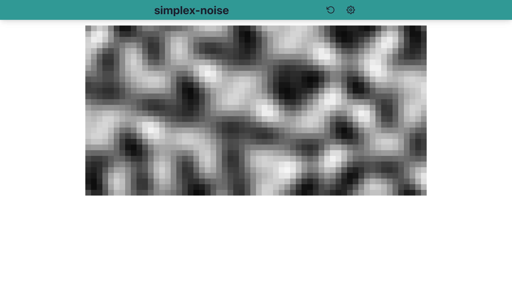
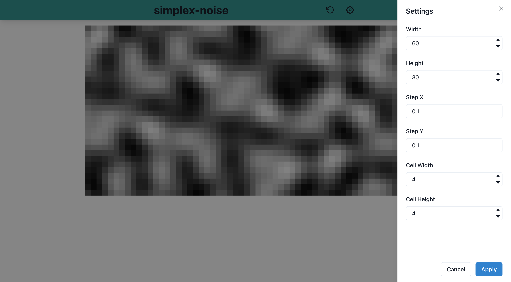

# simplex-noise-demo

A web app for trying out texture generation using simplex-noise.

## What's simplex-noise?

> Simplex noise is the result of an n-dimensional noise function comparable to Perlin noise ("classic" noise) but with fewer directional artifacts and, in higher dimensions, a lower computational overhead.
>
> https://en.wikipedia.org/wiki/Simplex_noise

> Perlin noise is a procedural texture primitive, a type of gradient noise used by visual effects artists to increase the appearance of realism in computer graphics. The function has a pseudo-random appearance, yet all of its visual details are the same size. This property allows it to be readily controllable; multiple scaled copies of Perlin noise can be inserted into mathematical expressions to create a great variety of procedural textures. Synthetic textures using Perlin noise are often used in CGI to make computer-generated visual elements – such as object surfaces, fire, smoke, or clouds – appear more natural, by imitating the controlled random appearance of textures in nature.
> 
> https://en.wikipedia.org/wiki/Perlin_noise

## Web app

[https://gh.s7a.dev/simplex-noise-demo](https://gh.s7a.dev/simplex-noise-demo)

It uses Math.random, so you'll see a similar but different texture each time you load the page.
You can also regenerate it with the reload icon.

Press the gear icon to open the settings screen.

## License

This web app is released under the MIT License, see [LICENSE](LICENSE).
